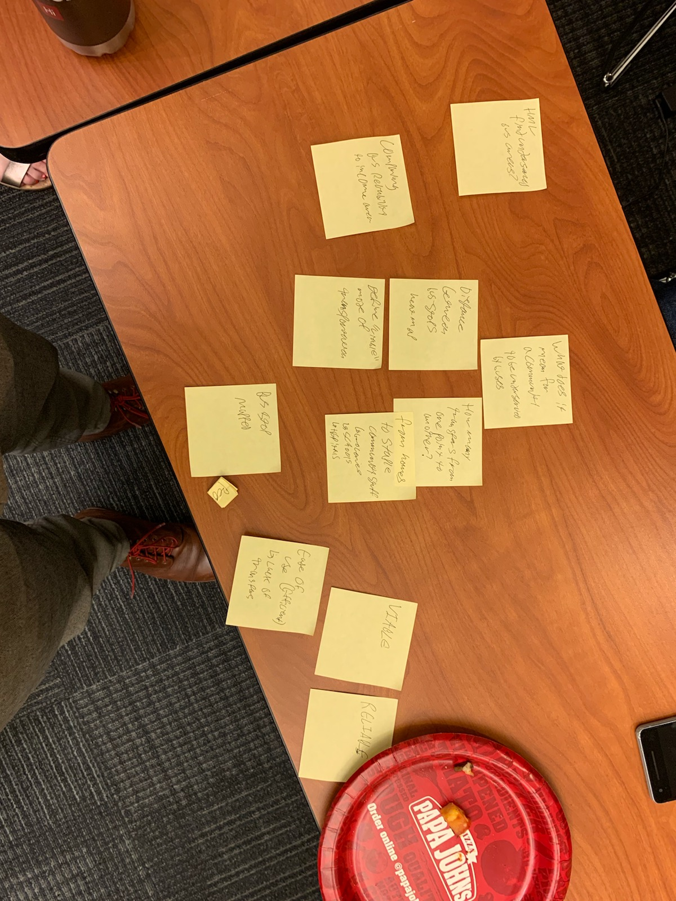

## DC Bus stuff
The purpose of this repo is to document projects, ideas, analyses that are based on / involve a historical archive of WMATA bus data.

The archive that this data comes from lives here: [https://github.com/markongithub/bus_data_archive](https://github.com/markongithub/bus_data_archive) (all credit to [@markongithub](https://github.com/markongithub) for this!)

http://busdata-00-us-west-2.s3-website-us-west-2.amazonaws.com/

## Project #1: H Street Bus Lane Pilot
Let's assess how well the Summer 2019 H Street Bus Lane Pilot went! https://ddot.dc.gov/page/h-i-streets-nw-bus-lane-pilot

Take a look in the [H street folder](h_street_intervention). There are two notebooks in there,
1. `h_street_pilot_explore.ipynb` shows how I computed the geolocation of all bus GPS readouts from H street.
2. `h_street_analysis.ipynb` shows some really basic analysis I did.

Data: https://drive.google.com/open?id=1T3qVgDHnR3kw6rm1_K9W428ChjsvrsnO

## Project #2: Cameras to detect bus activity.
Let's use cameras to count buses and then compare how that count lines up with the reported count (via the realtime feed) and also identify "missing" buses.

### WMATA Data sources
- Developer resources: https://www.wmata.com/about/developers/ (GTFS data lives here, you have to click on the "License Agreement" button, confusingly)
- APIs: https://developer.wmata.com/

### Code for DC 5/22 Observations & ideas:
- Something of value might be a "bus stop quality" score, based on how reliable the buses at that stop are. How does this factor into bus access?
- Given historical commute data, what is the travel time for those commuters if they took the bus? How many transfers would they have?
- back to the question of where are bottlenecks & where are the slowest buses... where do we need a bus lane??

